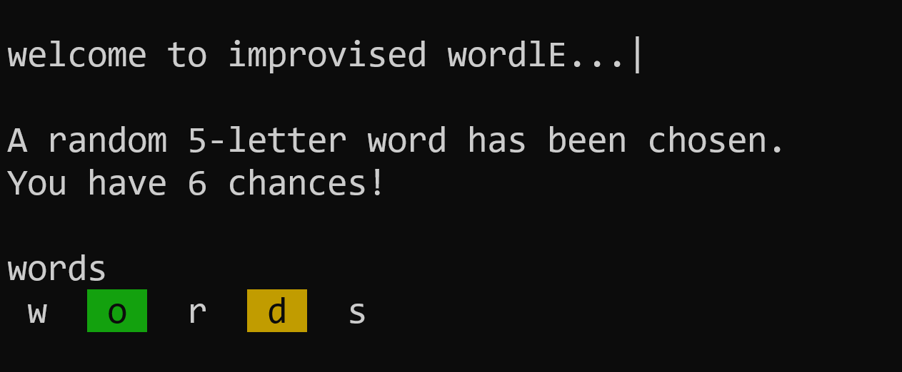
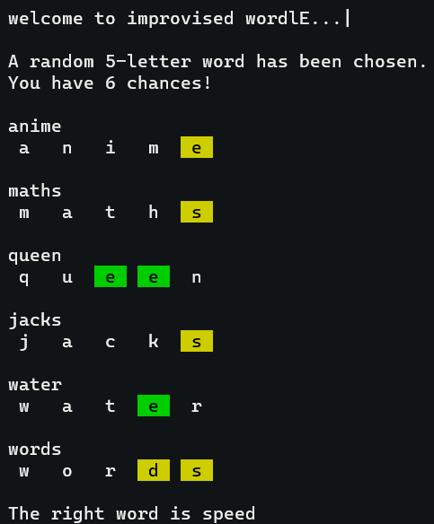
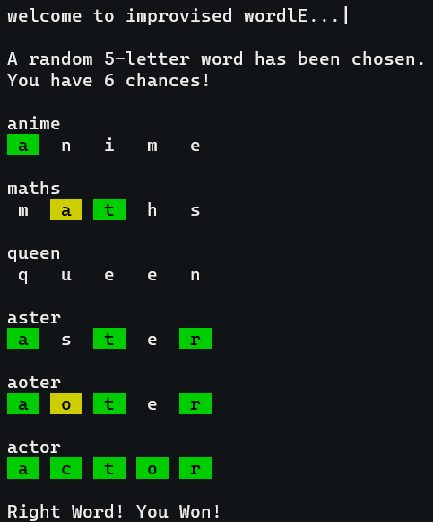

<div align="center">
  
</div>

## About
A terminal based clone to the popular online word puzzle game, [WORDLE](https://www.nytimes.com/games/wordle/index.html) 🟩🟨🔠

## Instructions

- The program will randomly choose a 5-letter word.

- You have 6 chances to guess the chosen word.

- Type any 5-letter word of your choice.

**NOTE:**

 🟨 **YELLOW** boxed letter → Entered letter is present, but in the wrong position.

 🟩 **GREEN** boxed letter → Entered letter is present and in the right position.

<table align="center">
  <tr>
    <td align="center">
      <br>
      <b>✅ When you get a right word</b>
    </td>
    <td align="center">
      <br>
      <b>❌ When its a wrong word</b>
    </td>
  </tr>
</table>


## Installation

Clone the Repository & navigate into the directory

```bash
git clone https://github.com/siliconvolley/cordle.git
cd cordle
```

Use Make to compile and execute

```bash
make
```

### OR

Compile the code

```bash
gcc -o bin/main.exe src/main.c
```

Start the game

```bash
./bin/main.exe
```
